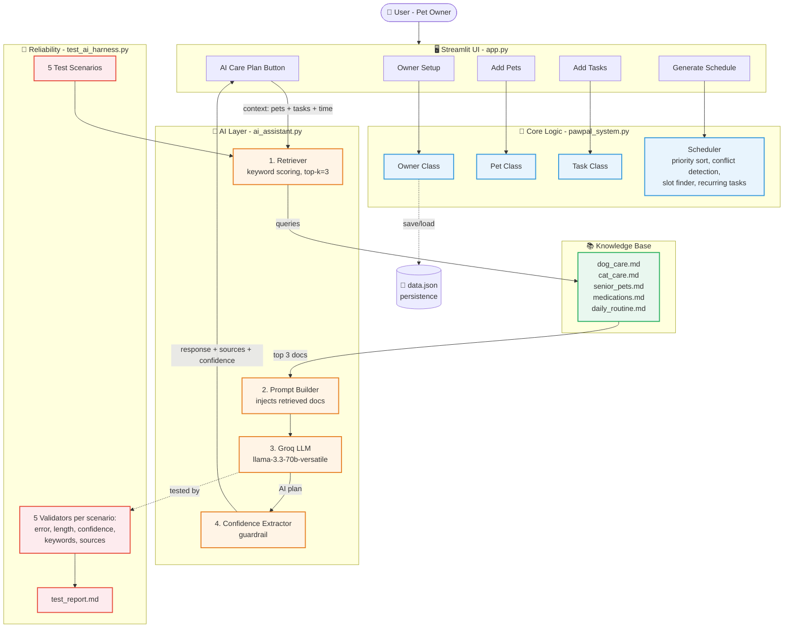

# 🐾 PawPal+ Applied AI System

> A pet care assistant that generates personalized daily care plans using **Retrieval-Augmented Generation (RAG)** + a built-in **AI reliability test harness**.

---

## 📌 Project Origin

This project extends my **Module 2 mini-project, PawPal+**, which was a deterministic Streamlit app for managing pet care tasks. The original app let users add pets, create care tasks, and generate a priority-based daily schedule with conflict detection, recurring task automation, and JSON persistence — but it had **no AI** in it.

For this final project, I added a full **AI layer** on top of the existing scheduler so the system can now generate **personalized, knowledge-grounded care plans** and **automatically test its own reliability**.

🔗 Original repo: [ai110-module2show-pawpal-starter](https://github.com/17arav/ai110-module2show-pawpal-starter)

---

## 🎬 Demo Video

📹 **Loom walkthrough:** _Add Loom link here after recording_

---

## ✨ What This System Does

PawPal+ helps a pet owner plan and manage daily care for one or more pets. The new AI features add:

| Feature | What it does |
|---|---|
| 🤖 **AI Care Plan (RAG)** | Generates a personalized daily plan grounded in 5 retrieved knowledge base documents |
| 📚 **Custom Knowledge Base** | 5 markdown files covering dogs, cats, senior pets, medications, and daily routines |
| 🧪 **Reliability Test Harness** | Runs the AI on 5 preset scenarios with 5 validators each (25 checks total), prints a pass/fail report |
| 🛡️ **Guardrails** | Logging, error handling, self-reported confidence scoring, and source transparency |

---

## 🏗️ System Architecture



### Architecture Overview

The system is built in **four layers**:

1. **UI layer (`app.py`)** — Streamlit interface where the user adds pets, tasks, generates schedules, and clicks the AI Care Plan button.
2. **Logic layer (`pawpal_system.py`)** — Original deterministic Python scheduler. Sorts by priority, detects time conflicts, finds open slots, handles recurring tasks. Untouched in this extension.
3. **AI layer (`ai_assistant.py`)** — The new RAG pipeline. When the user requests an AI plan, the system: (1) loads the knowledge base, (2) keyword-scores documents against the user's context, (3) injects the top 3 docs into a structured prompt, (4) calls the Groq LLM, (5) extracts a self-reported confidence label as a guardrail.
4. **Reliability layer (`test_ai_harness.py`)** — A standalone evaluation script that runs the AI against 5 preset scenarios, applies 5 validators per scenario (25 total checks), and writes a markdown report.

Data flows: **User → UI → Scheduler (deterministic plan) → AI Layer (retrieval + LLM) → UI (AI-augmented plan)**. The AI never replaces the scheduler — it adds a personalized, explained layer on top.

---

## ⚙️ Setup Instructions

### Prerequisites
- Python 3.10+
- A free [Groq API key](https://console.groq.com/keys)

### 1. Clone and enter the repo
```bash
git clone https://github.com/17arav/applied-ai-system-pawpal.git
cd applied-ai-system-pawpal
```

### 2. Create a virtual environment
```bash
python -m venv .venv
# Windows:
.venv\Scripts\activate
# Mac/Linux:
source .venv/bin/activate
```

### 3. Install dependencies
```bash
pip install -r requirements.txt
```

### 4. Add your Groq API key
Create a file called `.env` in the project root with this content:
```
GROQ_API_KEY=your_groq_key_here
```

### 5. Run the app
```bash
streamlit run app.py
```

### 6. (Optional) Run the AI reliability test harness
```bash
python test_ai_harness.py
```

### 7. (Optional) Run the unit tests for the scheduler
```bash
python -m pytest
```

---

## 💬 Sample Interactions

### Example 1 — Senior dog with arthritis

**Input context sent to AI:**
```
Owner: Jordan
Available time: 90 minutes
Pets: Max (9-year-old senior Labrador, special needs: arthritis)
Tasks: morning walk (30min), feeding (10min), joint medication (5min), evening walk (30min)
```

**AI output (excerpt):**
> Based on the **Senior Pets** and **Dog Care** guidelines, I recommend shorter, more frequent walks (15-20 min, 2-3x daily) instead of long ones. Joint medication should be given consistently at the same time daily. Total scheduled time: 75 minutes (15 minutes buffer).
>
> **Confidence: medium** — plan fits the time budget but limits Max's enrichment time.

**Sources retrieved:** `senior_pets.md`, `daily_routine.md`, `dog_care.md`

---

### Example 2 — Multi-pet household

**Input context sent to AI:**
```
Owner has 120 minutes available.
Pets: Rex (3-year-old dog) and Whiskers (5-year-old cat).
Tasks for Rex: walk (45min), feeding (10min).
Tasks for Whiskers: feeding (10min), play (15min).
```

**AI output (excerpt):**
> For Rex, I recommend a 45-minute morning walk plus 10-minute feeding (Dog Care: Feeding). For Whiskers, schedule 2-3 play sessions of 10-15 minutes each (Cat Care: Play and Enrichment). Feed pets separately if there's any food guarding (Daily Routine: Multi-Pet Households). Total: 80 minutes.
>
> **Confidence: medium**

**Sources retrieved:** `dog_care.md`, `cat_care.md`, `daily_routine.md`

---

### Example 3 — Tight time budget (overbooked)

**Input context sent to AI:**
```
Owner has only 30 minutes available.
Pet: Buddy, 4-year-old high-energy dog.
Tasks: walk (60min), feeding (10min), grooming (20min). Total = 90min.
```

**AI output (excerpt):**
> The 30-minute budget cannot accommodate all 90 minutes of tasks. I recommend prioritizing feeding (10 min) plus a shortened 20-minute walk today, and rescheduling grooming. High-energy breeds need 60-120 minutes of daily exercise (Dog Care: Daily Exercise) — please plan for a longer session tomorrow.
>
> **Confidence: low** — significant compromises required.

**Sources retrieved:** `daily_routine.md`, `dog_care.md`, `senior_pets.md`

---

## 🛠️ Design Decisions

| Decision | Why |
|---|---|
| **RAG over fine-tuning** | Knowledge base is small (5 docs); fine-tuning would be overkill and expensive. RAG also makes sources auditable. |
| **Keyword retrieval, not embeddings** | Keeps the project dependency-light and fast. Trade-off: weaker on semantic matches (see Testing Summary). |
| **Groq + Llama 3.3 70B** | Free tier, fast (~1.6s per call), no billing setup needed. |
| **Self-reported confidence** | Cheap and effective guardrail — the model is asked to label its own confidence, which is then parsed as a flag. |
| **AI sits on top of, not inside, the scheduler** | The deterministic scheduler still owns task ordering and conflict detection. The AI adds context-aware advice without replacing tested logic. |
| **Test harness is a separate script, not pytest** | Pytest doesn't fit well with non-deterministic LLM outputs; a custom validator-based runner gives clearer pass/partial/fail reporting. |

---

## 🧪 Testing Summary

The **AI test harness** (`test_ai_harness.py`) runs 5 scenarios with 5 validators each = **25 total checks**.

**Latest run results: 23/25 checks passed (92%)**

| Scenario | Result | Notes |
|---|---|---|
| Senior dog with arthritis | ✅ 5/5 | All keywords + sources matched |
| Young cat with playtime needs | ✅ 5/5 | High confidence on this one |
| Multi-pet household | ✅ 5/5 | Both pet names mentioned, both source docs retrieved |
| Tight time budget (overbooked) | ⚠️ 4/5 | Keyword "priority" not always used by the LLM |
| Medication-heavy senior pet | ⚠️ 4/5 | `medications.md` not retrieved — keyword scorer favored other docs |

**What I learned from testing:**
- Keyword retrieval is fast but **brittle** — when one keyword appears across many docs (e.g., "medication" appears in `senior_pets.md` and `cat_care.md`), the scorer can miss the most specific document.
- Self-reported confidence is **directionally correct**: the AI lowered its confidence to "low" on the over-booked scenario, which matches reality.
- Run-to-run variation is real — the same scenario got "medium" on one run and "high" on the next. The harness makes this measurable.

The unit tests for the deterministic scheduler (`tests/`) all pass:
```bash
python -m pytest
```

---

## 🤔 Reflection & Ethics

### Limitations and biases
- The knowledge base is small (5 documents) and reflects general best-practice guidance — it does **not** replace veterinary advice.
- Keyword retrieval has no semantic understanding (e.g., "vomiting" wouldn't match "throwing up").
- The LLM can produce confident-sounding advice even when sources are irrelevant — the confidence guardrail mitigates but doesn't eliminate this.

### Could it be misused?
A user could over-rely on the AI for medical situations that need a vet. Mitigations: (1) the prompt explicitly tells the AI to flag risky activities, (2) confidence is shown to the user, (3) the README and UI both communicate that this is a planning aid, not medical advice.

### What surprised me
The AI sometimes gets the *general* answer right but misses the *most specific* knowledge base doc. This taught me that retrieval quality matters as much as model quality — a great LLM with bad retrieval gives a confidently wrong answer.

### My collaboration with AI on this project
I used Claude as a coding pair-programmer throughout this project.

- **Helpful suggestion:** When I asked how to add reliability testing, Claude suggested a custom validator-based harness instead of pytest, because LLM outputs are non-deterministic. This turned out to be exactly right and produced clean, readable test reports.
- **Flawed suggestion:** Claude initially recommended `gemini-2.0-flash` as the model, but my Gemini account didn't have access to it (received a 404). I had to switch providers to Groq. Lesson: AI suggestions should be tested in your specific environment, not trusted blindly.

---

## 📂 Project Structure

```
applied-ai-system-pawpal/
├── app.py                    # Streamlit UI (extended with AI section)
├── pawpal_system.py          # Original scheduler logic (unchanged)
├── ai_assistant.py           # NEW — RAG pipeline (retriever + LLM + guardrails)
├── test_ai_harness.py        # NEW — 5-scenario reliability test harness
├── main.py                   # Original CLI entry point
├── data.json                 # Persisted owner/pet/task data
├── test_report.md            # Auto-generated test report
├── requirements.txt
├── .env                      # API key (not in repo)
├── .gitignore
├── tests/                    # pytest unit tests for the scheduler
├── knowledge_base/           # NEW — RAG source documents
│   ├── dog_care.md
│   ├── cat_care.md
│   ├── senior_pets.md
│   ├── medications.md
│   └── daily_routine.md
└── assets/                   # Diagrams and screenshots
    └── architecture.mmd
```

---

## 🎯 Rubric Alignment

| Rubric requirement | Where to find it |
|---|---|
| Required AI feature: RAG | `ai_assistant.py` (retriever + prompt + LLM) |
| Required AI feature: Reliability testing | `test_ai_harness.py` |
| System diagram | Mermaid diagram above + `assets/architecture.mmd` |
| Logging / guardrails | `ai_assistant.py` (logging, try/except, confidence extraction) |
| Sample interactions | "Sample Interactions" section above |
| Testing summary | "Testing Summary" section above |
| Reflection / ethics | "Reflection & Ethics" section above |
| Stretch: Test harness script | `test_ai_harness.py` (5 scenarios × 5 validators, prints summary) |
| Stretch: RAG enhancement | Custom 5-document knowledge base + transparent source tracking |

---

_Built with Streamlit, Groq, and a lot of treats. 🐾_